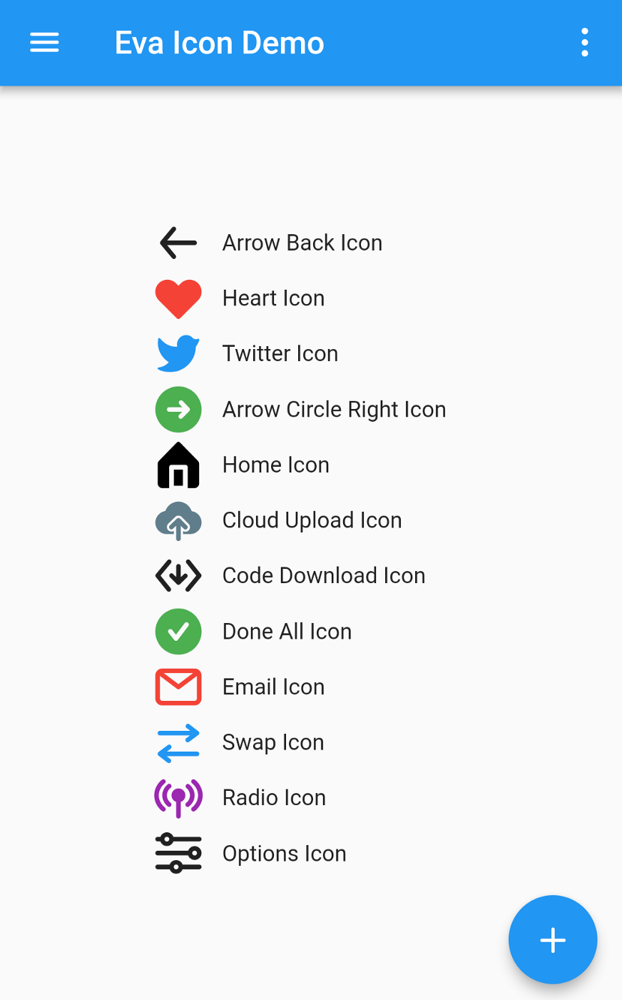

# eva_icons_flutter

Flutter package for [Eva Icons](https://akveo.github.io/eva-icons/). Eva Icons is a pack of more than 480 beautifully crafted Open Source icons for common actions and items.

This package brings [Eva Icons](https://akveo.github.io/eva-icons/) pack available as Flutter Icons. It has beautiful outlined and rounded Icons.

## Installation

In the dependencies: section of your `pubspec.yaml`, add the following line:

```yaml
eva_icons_flutter: <latest_version>
```

## Usage

```dart
import 'package:eva_icons_flutter/eva_icons_flutter.dart';

class MyWidget extends StatelessWidget {
  Widget build(BuildContext context) {
    return IconButton(
      // Use the EvaIcons class for the IconData
      icon: Icon(EvaIcons.heart),
      onPressed: () { print("Eva Icon heart Pressed"); }
     );
  }
}
```

## Example

View the Flutter app in the `example` directory.

## Screenshot



## Contributors

- [Piyush Maurya](https://github.com/piyushmaurya23/)
- [Karan Shah](https://github.com/karan413255)
